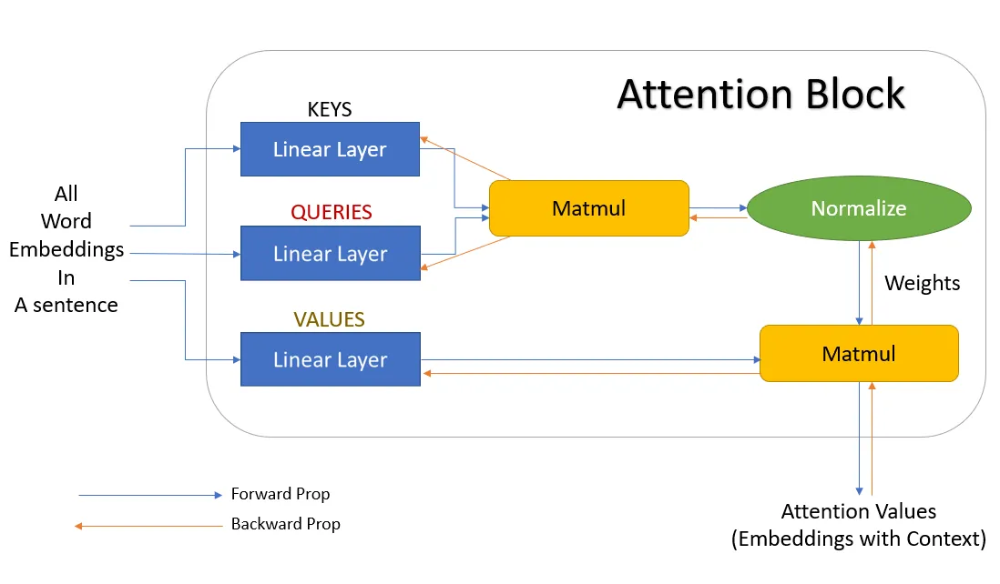
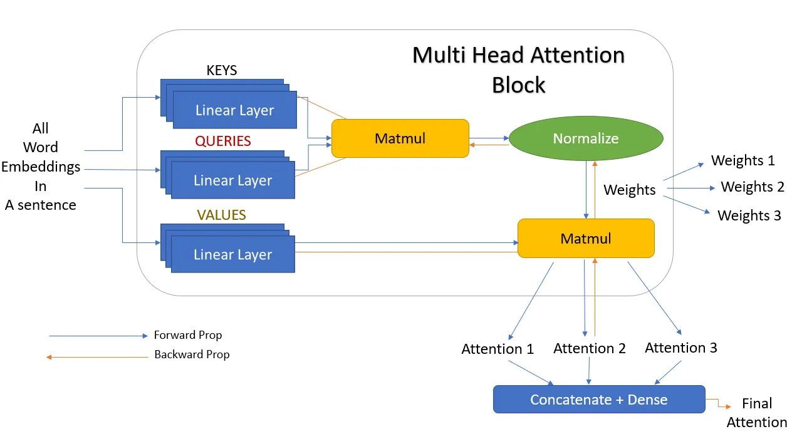

# The Illustrated Transformer: Attention Is All You Need 🧠

The Transformer was proposed in the paper Attention is All You Need [[1]](#ref1). The impact of this paper has been tremendous. It paved the way for a new generation of models such as BERT, GPT-2/3/4, T5, and others, which have achieved state-of-the-art results on a wide range of NLP tasks, including machine translation, text summarization, and sentiment analysis. These models, based on the Transformer architecture, have pushed the boundaries of what's possible with NLP, making applications like real-time translation, automatic content generation, and advanced chatbots a reality.

In this notebook we will attempt to recreate the “annotated” version of the paper in the form of a line-by-line implementation. We will be using several resources to aid our task:
 - The Illustrated Transformer by Jay Alammar [[2]](#ref2)
 - Harvard’s NLP group created a guide annotating the paper with PyTorch implementation [[3]](#ref3)

## Overview 📖

The Transformer model's impact is profound, enabling state-of-the-art models like BERT, GPT-2/3/4, T5, and others to excel in tasks like machine translation, text summarization, and sentiment analysis. It has shaped NLP applications, making real-time translation, content generation, and advanced chatbots not just conceivable but accessible.

In this repository, we unravel the Transformer's magic by recreating an "annotated" version of the original paper through a line-by-line implementation. Guided by resources like "The Illustrated Transformer" by Jay Alammar [2] and a PyTorch-annotated guide by Harvard’s NLP group [3], this notebook offers an in-depth look into the inner workings of the model.

The key idea behind the Transformer is the self-attention mechanism, which computes a weighted sum of all words in a sentence for each word, where the weights are determined by the compatibility of the word with all others.

This model eliminated the need for recurrence and convolution, which were the dominant paradigms in the field up until then, and it allowed for much more parallelizable training, significantly reducing training times. It also improved the handling of long-term dependencies in text, a notorious difficulty with previous models.

## Challenges in RNN that Transformer models help overcome

<table>
  <tr>
    <th><b>Challenges</b></th>
    <th><b>RNNs</b></th>
    <th><b>Transformers</b></th>
  </tr>
  <tr>
    <td>Long-Range Dependencies</td>
    <td>RNNs struggls with long-distance dependencies. RNNs typically falter when handling long text documents</td>
    <td>Transformer architectures primarily rely on attention mechanisms. These mechanisms allow the model to establish relationships between any parts of a sequence, making it adept at handling long-distance dependencies. With transformers, long-distance dependencies are as likely to be addressed as any shorter-distance ones.</td>
  </tr>
  <tr>
    <td>Vanishing and exploding gradients</td>
    <td>Suffers from gradient vanishing and gradient explosion.</td>
    <td> Transformers experience minimal vanishing or exploding gradient issues. The complete sequence is trained simultaneously in Transformer networks, supplemented by only a few additional layers. Therefore, gradient problems are seldom encountered</td>
  </tr>
    <tr>
        <td>Training steps required to reach a local/global minima</td>
        <td>RNNs require more training steps to reach local or global minima. When visualized, RNNs appear as deep, unrolled networks with the network's depth determined by the sequence's length. This leads to a high number of parameters, many of which are interconnected, resulting in longer training times and a need for multiple steps</td>
        <td>Transformers require less training steps compared to RNNs</td>
    </tr>
    <tr>
        <td>Parallel Computation</td>
        <td>RNNs are unable to support parallel computation. Despite the benefits of GPUs in enabling parallel computation, RNNs function as sequence models, meaning all network computations occur sequentially, prohibiting parallelization</td>
        <td>The absence of recurrence in transformer networks facilitates parallel computation. This means computations can occur concurrently at every step</td>
    </tr>
</table>

## Attention Mechanism
### Self-Attention Module
Sentence is fed to a computer, and it considers each word as a token t, and each token has a word embedding V with shape [vocub_size, model_dimension]. But these word embeddings have no context. So the idea is to apply some kind of weighing or similarity to obtain final word embedding Y, which has more context than the initial embedding V.

- first find the weights by multiplying (dot product) the initial embedding of the first word with the embedding of all other words in the sentence. 
- nomralize these weights to have a sum of 1.
- multiply the normalized weights with the initial embeddings of all the words in the sentence

All weights will have the context of the first word. So when we are multiplying these weights to each word, we are essentially reweighing all the other words towards the first word. This is repeated for all words so that each word gets some context from every other word in the sentence.

Weights are not trained, the order or proximity of the words have no influence on each other. Also, the process has no dependency on the length of the sentence, that is, more or fewer words in a sentence do not matter. This approach of adding some context to the words in a sentence is known as Self-Attention.

Since weights are not trained, we utilize three other trainable parameters which are matrices whose values are trained: 
- Query: send V1 as the Query word - $xMk$
- Key: dot product between the query (the first word embedding) and all other words obtain weights - $xMq$
- Value: multiply normalized weight with the initial embeddings of all other words in the sentence - $xMv$

Matrices Mk, Mq, and Mv are the trainable parameters by the neural networks. 

**Figure 1**. Neural network representation of Attention block (source: <a href='https://towardsdatascience.com/all-you-need-to-know-about-attention-and-transformers-in-depth-understanding-part-1-552f0b41d021#4c16'>‘Attention’ and ‘Transformers’ — In-depth Understanding — Part 1</a>)

### Multihead Attention Module
Let's take a more straightforward sentence as an example - "Anna reads books and she loves it". Here, if we consider the word 'reads', the words 'Anna', 'books', and 'she' should have a meaningful connection with 'reads'. These words indicate that Anna is the one who is involved in the activity of reading, she is female, and the objects of her reading activity are books. A solitary attention mechanism may struggle to accurately connect all these words to 'reads', suggesting that the deployment of three attention heads could be more effective in emphasizing the words associated with 'reads'. This approach lessens the burden on a single attention head to identify all the significant words, thereby enhancing the likelihood of more successfully recognizing the pertinent words.

The keys, queries, and values undergo transformation through the addition of more linear layers. These layers are trained concurrently, maintaining distinct weights. As a result, each of the keys, queries, and values now yields three outputs, as opposed to just one. Consequently, three distinctive sets of weights are generated from these three keys and queries. Each weight set is then subjected to matrix multiplication with the respective values, leading to the creation of three unique outputs. These three attention outputs are ultimately fused together through concatenation, producing a single, final attention output. This process can be visualized as shown in Figure 2.  

**Figure 2**. Neural network representation of Multihead Attention block (source: <a href='https://towardsdatascience.com/all-you-need-to-know-about-attention-and-transformers-in-depth-understanding-part-1-552f0b41d021#4c16'>‘Attention’ and ‘Transformers’ — In-depth Understanding — Part 1</a>)

## Conclusion 🏁

The Transformer model has undoubtedly paved the way for next-gen NLP models. By dissecting its architecture, understanding the mechanics, and implementing it, we get closer to leveraging its full potential for various applications.

Join us in this fascinating journey as we explore the Transformer model, one line of code at a time!

---

**References**:

[1] [Attention is All You Need](https://arxiv.org/abs/1706.03762)

[2] [The Illustrated Transformer by Jay Alammar](http://jalammar.github.io/illustrated-transformer/)

[3] [Harvard’s NLP group guide with PyTorch implementation](https://nlp.seas.harvard.edu/2018/04/03/attention.html)
